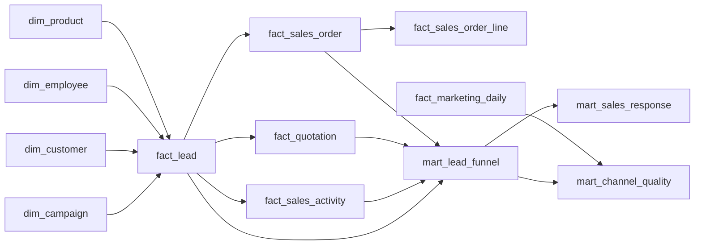

# Data Model — Project 01: B2B Lead-to-Order Analytics

## 1. Model Boundary

This repository begins at the **Gold Layer**. Raw ingestion, profiling, cleaning, datatype standardization, duplicate handling, and reconciliation belong to the upstream Silver Layer repository:

https://github.com/FatBoyIL/SEPRO_Cleaning_Data

The Gold Layer converts trusted Silver entities into reusable dimensions, business facts, and analytical marts at explicit grains.

## 2. Source-to-Gold Lineage

```text
Synthetic CSV Sources
        ↓
Bronze
        ↓
Silver
        ↓
Gold Dimensions + Facts
        ↓
Analytical Marts
        ↓
SQL Analysis / Power BI
```

### Main source-domain inputs

| Source domain | Main role |
|---|---|
| `leads_raw.csv` | CRM lead population and lead attributes |
| `sales_activities_raw.csv` | Sales interaction timestamps and outcomes |
| `quotations_raw.csv` | Quotation header evidence by lead |
| `quotation_lines_raw.csv` | Product/value detail within quotation |
| `sales_orders_raw.csv` | Sales Order evidence and commercial conversion |
| `sales_order_lines_raw.csv` | Ordered products, quantities, price, cost, discount |
| `marketing_daily_raw.csv` | Campaign/channel spend and traffic metrics |
| Shared customer/campaign/product/employee files | Context and dimensional attributes |

## 3. Gold Dimensions

| Gold object | Grain | Purpose |
|---|---|---|
| `gold.dim_date` | 1 row per calendar date | Consistent date filtering and time analysis |
| `gold.dim_campaign` | 1 row per campaign | Canonical campaign and channel attribution |
| `gold.dim_customer` | 1 row per customer | Customer segment and industry context |
| `gold.dim_employee` | 1 row per employee | Sales ownership and diagnostic slicing |
| `gold.dim_product` | 1 row per product | Product/category context |

## 4. Gold Facts

| Gold object | Grain | Main analytical use |
|---|---|---|
| `gold.fact_lead` | 1 row per lead | Lead population, lifecycle, ownership, source |
| `gold.fact_sales_activity` | 1 row per sales activity | First response and Sales activity diagnostics |
| `gold.fact_quotation` | 1 row per quotation header | Quote-stage evidence |
| `gold.fact_sales_order` | 1 row per sales order | Order-stage evidence and order dates |
| `gold.fact_sales_order_line` | 1 row per sales order line | Product-level order value and quantity |
| `gold.fact_marketing_daily` | 1 row per date × campaign/source platform | Marketing spend and traffic performance |

## 5. Analytical Marts

### `gold.mart_lead_funnel`

**Grain:** 1 row = 1 lead.

This is the central Project 01 mart. It resolves the one-to-many relationships from activities, quotation versions, and orders before funnel rates are calculated.

Important fields include:

- `lead_id`
- `channel`
- `qualified_flag`
- `quote_flag`
- `order_flag`
- `first_response_at`
- `first_response_hours`
- `response_bucket`
- `order_count`
- `net_order_value_vnd`

### `gold.mart_sales_response`

**Grain:** 1 row = 1 response-time bucket.

Used to compare Lead-to-Quote and Lead-to-Order conversion across response-time groups.

### `gold.mart_channel_quality`

**Grain:** analysis date × campaign × channel.

Used to evaluate marketing sources with several dimensions together: spend, volume, qualification, conversion, and order value.

## 6. Relationship Logic



## 7. Grain Controls

The most important modeling risk in this project is **fan-out**.

Examples:

- one lead can have many Sales activities;
- one lead can have multiple quotation versions;
- one lead can create more than one Sales Order;
- one Sales Order can have multiple lines.

For that reason, funnel conversion is calculated only after the event tables have been reduced to **one lead grain**.

## 8. Attribution Rules

- Channel is attributed through the cleaned campaign/channel mapping rather than grouping raw source text directly.
- Quote conversion is based on the existence of a quotation record.
- Order conversion is based on actual Sales Order evidence.
- For Lead-to-Order conversion, new-order logic should be kept separate from repeat-order behavior.
- Order value in Project 01 is a Sales Order value proxy, not invoice/cash revenue.

## 9. Power BI Modeling Note

Power BI should primarily consume the analytical marts rather than recreate complex joins among transaction facts. This keeps KPI logic centralized in Gold and reduces ambiguous many-to-many relationships.
